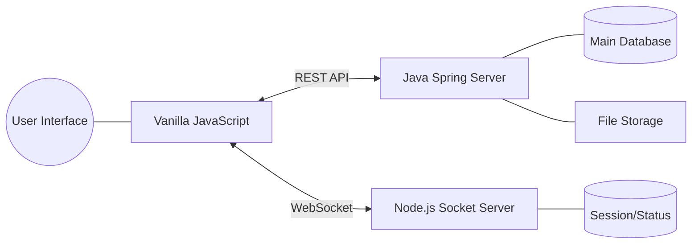

# 🌐 Enterprise Collaboration Hub (ECH)

> **Java & Node.js 기반의 고성능 사내 협업 플랫폼**
> 실시간 소통부터 관리자 관제까지, 사내 인프라를 최대로 활용한 통합 협업 솔루션입니다.

---

## 📌 프로젝트 개요 (Overview)
**ECH**는 기존 시스템의 안정성과 최신 협업 툴의 기민함을 결합한 프로젝트입니다. Java의 견고한 비즈니스 로직 처리와 Node.js의 빠른 실시간성을 활용하여 가볍고 끊김 없는 사용자 경험을 제공하는 것을 목표로 합니다.
또한 Slack, Flow, Teams를 모티브로 하여 채널 중심 협업, 실시간 소통, 업무 연계 경험을 제공하는 것을 지향합니다.

## ✨ 주요 기능 (Key Features)

### 💬 실시간 커뮤니케이션
- **채널 기반 메시징:** 프로젝트/부서별 공개 및 비공개 채널 운영
- **스레드(Thread) 대화:** 대화 맥락을 유지하는 답글 및 반응 기능
- **실시간 상태(Presence):** 온라인/자리비움/오프라인 상태 확인 및 업데이트
- **읽음 포인터:** 채널별 마지막으로 읽은 메시지 저장·조회(미읽음 UX 기반)

### 🤝 협업 및 데이터 관리
- **파일 공유:** 외부 스토리지 연동 전제의 채널별 파일 메타데이터 등록·목록·다운로드 안내 API
- **칸반 보드:** 워크스페이스별 보드·컬럼·카드 CRUD, 담당자 지정, 상태/컬럼 이동 이력 API
- **채팅→업무:** 메시지 ID 기준 업무 항목 생성·조회(메시지와 1:1 링크)
- **통합 검색:** 대화 내역 및 공유 파일에 대한 고속 검색 지원
- **조직도(부서) 기반 사용자 검색:** 이름/이메일/사번/부서 필터로 사용자 조회

### 🛠 관리자 시스템 (Admin Dashboard)
- **그룹웨어 SSO 연동:** 별도 가입 없이 기존 사내 계정으로 즉시 로그인
- **통계 시각화:** 접속자 수, 메시지 전송량 등 주요 지표를 그래프로 시각화 (Chart.js 활용)
- **사용자 및 권한 관리:** 부서별 권한 설정, 퇴사자 계정 비활성화 및 보안 로그 감사
- **시스템 관제:** 소켓 서버 연결 상태 확인 및 전사 공지사항 즉시 배포
- **버전 업그레이드 관리:** 관리자 페이지에서 배포 파일(WAR 등) 업로드, 버전 전환, 롤백 이력 관리

---

## 🛠 기술 스택 (Technical Stack)

| 구분 | 기술 (Tech) | 역할 (Role) |
| :--- | :--- | :--- |
| **Backend (Core)** | **Java / Spring Boot** | 비즈니스 로직, 인증, DB 트랜잭션 및 API 관리 |
| **Real-time** | **Node.js / Socket.io** | 실시간 메시지 중계, 알림 및 소켓 연결 관리 |
| **Frontend** | **Vanilla JS (ES6+)** | 외부 라이브러리를 최소화한 가볍고 빠른 반응형 UI |
| **Database** | **PostgreSQL** | 사용자 정보, 채널 구성, 메시지 및 업무 데이터 저장 |
| **Storage** | **File Server (NAS/S3)** | 사내 규정에 맞춘 대용량 첨부 파일 및 미디어 저장 |

---

## 🏗 시스템 아키텍처 (Architecture)



---

## 📁 기본 프로젝트 틀 (Scaffold)
기본 구조와 파일별 역할은 별도 문서에서 관리합니다.

### 핵심 문서 바로가기
- 상세 문서: `docs/PROJECT_SCAFFOLD.md`
- 기능/조건 명세: `docs/PROJECT_REQUIREMENTS.md`
- 로컬 환경 설정: `docs/ENVIRONMENT_SETUP.md`
- 개발 로드맵: `docs/ROADMAP.md`
- 기능 명세서: `docs/FEATURE_SPEC.md`
- RBAC 매트릭스: `docs/RBAC_MATRIX.md`
- 인수인계서: `docs/HANDOVER.md`
- DB 스키마 초안: `docs/sql/postgresql_schema_draft.sql`
- 테스트 사용자·부서 시드: `docs/sql/seed_test_users.sql` (그룹웨어 미연동 시, `docs/ENVIRONMENT_SETUP.md` 참고)
- 변경 이력: `.cursor/rules/CHANGELOG.md`
- 에러 이력: `.cursor/rules/ERRORS.md`

## ✅ 현재 구현된 API/이벤트 (요약)

### Backend API
- `GET /api/health`
- `POST /api/channels`
- `GET /api/channels/{channelId}`
- `POST /api/channels/{channelId}/members`
- `GET /api/channels/{channelId}/read-state?userId=...`
- `PUT /api/channels/{channelId}/read-state`
- `GET /api/channels/{channelId}/files?userId=...`
- `POST /api/channels/{channelId}/files`
- `GET /api/channels/{channelId}/files/{fileId}/download-info?userId=...`
- `POST /api/channels/{channelId}/messages`
- `POST /api/channels/{channelId}/messages/{parentMessageId}/replies`
- `GET /api/channels/{channelId}/messages/{parentMessageId}/replies`
- `GET /api/users/search?q=...&department=...`
- `POST /api/kanban/boards`, `GET /api/kanban/boards`, `GET /api/kanban/boards/{boardId}`, `DELETE /api/kanban/boards/{boardId}`
- `POST /api/kanban/boards/{boardId}/columns`, `PUT /api/kanban/boards/{boardId}/columns/{columnId}`, `DELETE .../columns/{columnId}`
- `POST /api/kanban/boards/{boardId}/columns/{columnId}/cards`, `PUT /api/kanban/cards/{cardId}`, `DELETE /api/kanban/cards/{cardId}`
- `POST /api/kanban/cards/{cardId}/assignees`, `DELETE /api/kanban/cards/{cardId}/assignees/{assigneeUserId}?actorUserId=...`
- `GET /api/kanban/cards/{cardId}/history?limit=`
- `POST /api/messages/{messageId}/work-items`, `GET /api/messages/{messageId}/work-items`, `GET /api/work-items/{workItemId}`
- `GET /api/admin/org-sync/users?source=TEST|GROUPWARE` (현재 `TEST`만 지원)
- `POST /api/admin/org-sync/users/sync?source=TEST|GROUPWARE`
- `PUT /api/admin/org-sync/users/{employeeNo}/status`
- `GET /api/admin/error-logs?from=&to=&errorCode=&path=&limit=`

### RBAC(현재)
- 헤더 `X-User-Role` 기준 최소 권한 체크 (`MEMBER`/`MANAGER`/`ADMIN`)
- `ADMIN`: `/api/admin/org-sync/**`
- `MANAGER+`: 사용자 검색, 채널 생성/멤버 추가, 칸반 변경 API
- 상세 매트릭스: `docs/RBAC_MATRIX.md`

### 운영 오류 로그(민감정보 비수집)
- 전역 예외를 `error_logs` 테이블에 저장하고 관리자 API로 조회 가능
- 메시지 본문/파일 원문/토큰 등 민감 데이터는 저장하지 않음

### 감사 이벤트 로그(Phase 3-3)
- 채널·메시지·파일·업무·칸반 도메인의 주요 이벤트를 `audit_logs` 테이블에 기록
- 이벤트 유형(채널 생성/참여, 메시지 전송, 파일 업로드, 업무 생성, 칸반 변경 등)을 `AuditEventType` Enum으로 관리
- 대화 본문 미기록 원칙 준수, `detail` 최대 500자 메타데이터만 수집
- 관리자 조회 API: `GET /api/admin/audit-logs` (기간·행위자·이벤트유형·리소스유형·워크스페이스 필터)

### Realtime 이벤트/엔드포인트
- Socket: `channel:join`, `message:send`, `message:new`, `message:error` (`MESSAGE_TOO_LARGE` 등)
- Presence: `presence:set`, `presence:update`, `presence:error` (전 소켓 종료 시 OFFLINE 정리)
- HTTP: `GET /health`, `GET /presence`

### 운영·성능 메모 (요약)
- Realtime: Presence는 소켓 단위 추적·전원 종료 시 맵에서 제거, 메시지 본문 길이·소켓 버퍼 상한, `pg` 커넥션 풀 타임아웃 설정 가능
- Backend: Hikari 최대 풀 크기·커넥션 타임아웃 환경변수 연동
- Frontend 데모: 메시지 DOM 최대 200건으로 유지

## 🚀 빠른 시작 (Docker 미사용)

### 1) 로컬 DB 준비
- PostgreSQL을 로컬에 설치합니다.
- `.env.example`을 참고해 환경 변수를 설정합니다.

예시:
```bash
DB_HOST=localhost
DB_PORT=5432
DB_NAME=ech
DB_USER=ech_user
DB_PASSWORD=ech_password
SPRING_PORT=8080
SOCKET_PORT=3001
```

### 2) Realtime 서버 실행 (Node.js)
```bash
cd realtime
npm install
npm run dev
```

### 3) Backend 서버 실행 (Spring Boot)
Windows:
```bash
cd backend
gradlew.bat bootRun
```

macOS/Linux:
```bash
cd backend
./gradlew bootRun
```

### 4) Frontend 확인
- `frontend/index.html`을 브라우저에서 열어 UI를 확인합니다.
- 기본 소켓 서버 주소는 `http://localhost:3001`입니다.
