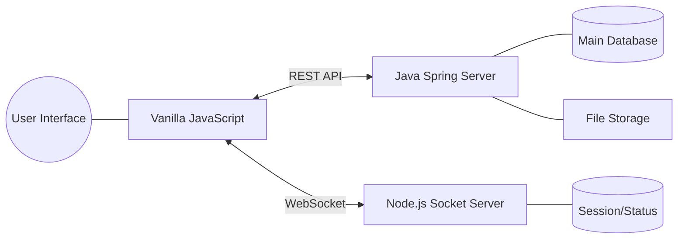

# 🌐 Enterprise Collaboration Hub (ECH)

> **Java & Node.js 기반의 고성능 사내 협업 플랫폼**
> 실시간 소통부터 관리자 관제까지, 사내 인프라를 최대로 활용한 통합 협업 솔루션입니다.

---

## 📌 프로젝트 개요 (Overview)
**ECH**는 기존 시스템의 안정성과 최신 협업 툴의 기민함을 결합한 프로젝트입니다. Java의 견고한 비즈니스 로직 처리와 Node.js의 빠른 실시간성을 활용하여 가볍고 끊김 없는 사용자 경험을 제공하는 것을 목표로 합니다.
또한 Slack, Flow, Teams를 모티브로 하여 채널 중심 협업, 실시간 소통, 업무 연계 경험을 제공하는 것을 지향합니다.

## ✨ 주요 기능 (Key Features)

### 💬 실시간 커뮤니케이션
- **채널 기반 메시징:** 프로젝트/부서별 공개 및 비공개 채널 운영
- **스레드(Thread) 대화:** 대화 맥락을 유지하는 답글·댓글; 햄버거 메뉴 **스레드 모아보기**로 활동 중인 원글을 한곳에서 열기
- **실시간 상태(Presence):** 온라인/자리비움/오프라인 상태 확인 및 업데이트(채팅·멤버 목록 옆 표시)
- **@멘션:** 입력창 `@` 자동완성은 **현재 채널·DM 멤버만**(채널 상세 `members` 기준), 저장 토큰 `@{사번|이름}`; 피멘션자에게 `mention:notify`·우하단 토스트, 클릭 시 해당 채널로 이동. 현재 보고 있지 않은 채널 멘션은 사이드바 **멘션 목록(미확인만)** 으로 관리되며 클릭 시 해당 채널/메시지로 이동
- **읽음 포인터·미읽음 배지:** 채널별 마지막으로 읽은 메시지 저장·조회; 목록 API `unreadCount`(루트 메시지 기준)로 채널/DM 사이드바에 빨간 원형 숫자 배지; **`lastMessageAt`** 로 최근 대화 순; **퀵 레일**은 ECH 제목 아래·검색~목록과 같은 높이 구간에만(64px 열); **미읽음 우선·최근 대화** 최대 15개·배지는 미읽음만; 패널 펼침 **324px**, 접힘 시 **퀵 64px만**; **접기**는 우측 **돌출 탭**·`localStorage` `ech_sidebar_collapsed`
- **내 프레즌스:** 좌측 하단 상태 줄 클릭으로 **온라인 / 자리비움**(실시간 서버 `presence:set`)

### 🤝 협업 및 데이터 관리
- **채널 운영:** 개설자는 멤버 패널에서 구성원 **내보내기**(REST `DELETE .../members`); 내보내기 시 **시스템 메시지**가 DB·채팅에 남고, 실시간 서버가 구독 중인 클라이언트에 `channel:system`로도 전달(내부 HTTP, `REALTIME_INTERNAL_TOKEN` 선택)
- **채널 운영 확장:** 우측 상단 **햄버거 메뉴**에서 업무/첨부/구성원/**알림 끄기·켜기**(다른 채의 **일반 메시지 토스트만** 끔; **멘션 토스트·미읽음 배지는 유지**)/나가기/채널 폐쇄를 통합 제공, 관리자는 채널명 변경 가능, 관리자 위임은 멤버 우클릭 메뉴로 수행. 채널·DM·퀵 레일 목록 **우클릭**으로 알림 토글·**퀵 레일에 고정**(순서 고정)·나가기 가능(알림 음소거·퀵 고정은 브라우저 `localStorage` 사원별)
- **파일 공유:** 채널별 업로드(multipart)·목록·다운로드(JWT), 디스크 경로에 워크스페이스·채널 식별 세그먼트 포함
- **이미지 첨부:** 채팅에 인라인 미리보기, 클릭 시 확대(라이트박스), 확대 화면에서 다운로드; 채팅 화면에서 클립보드 이미지 **붙여넣기(Ctrl+V)** 로 전송 대기(기존 파일 첨부·전송 흐름과 동일)
- **첨부 UX:** 업로드 즉시 채팅 본문에 파일 카드 표시 + 햄버거 메뉴 **첨부파일**·**이미지 모아보기**(채널/DM 공통; 전체 탭은 비이미지 첨부만, 이미지는 이미지 탭 전용)
- **칸반 보드:** 워크스페이스별 보드·컬럼·카드 CRUD, 담당자 지정, 상태/컬럼 이동 이력 API
- **채팅→업무:** 메시지 ID 기준 업무 항목 생성·조회(메시지와 1:1 링크)
- **채널 업무 허브:** 채널 헤더 `📋`에서 업무·칸반을 한 모달에서 조회하고, 신규/상태/컬럼 이동/순서 변경은 **저장**으로 반영, 항목 **삭제(✕)**, 칸반 **채널 멤버**(본인 포함) 담당 지정·자동완성(이름/조직·직급 구분, 키보드 선택 지원), 카드는 컬럼 안·**컬럼 간** **드래그앤드롭**으로 이동하며 저장 시 컬럼에 맞게 카드 `status`도 함께 반영. **저장** 성공 시 사이드바 **내 업무 항목** 목록도 즉시 갱신
- **내 업무 항목(담당 칸반):** 좌측 사이드바에 내가 칸반 카드 담당인 업무를 표시. 행 클릭 시 **채팅 채널 전환 없이** 해당 채널의 업무·칸반 모달만 연다
- **업무/칸반 상세 편집:** 목록 카드 클릭 시 상세 모달에서 제목·설명·상태를 수정하고, 칸반 카드는 담당자 추가/해제까지 지원하며 변경은 저장 버튼에서 일괄 반영
- **공통 다이얼로그:** 브라우저 기본 `alert/confirm` 대신 중앙 모달형 공통 메시지창(`uiAlert/uiConfirm/uiPrompt`) 사용
- **통합 검색:** 대화 내역 및 공유 파일에 대한 고속 검색 지원
- **조직도·사용자 검색:** 이름/이메일/사번/부서/사용자 ID 검색, **회사→본부→팀** 조직 트리에서 멤버 선택(채널·DM·구성원 추가는 검색+조직도 **통합 모달**), 동료 프로필 모달(이름·사원번호·이메일·부서·직위, 직책은 있을 때만 표시, **DM 보내기**로 즉시 DM 시작)
- **멤버 관리:** 채널 생성 이후에도 구성원 추가 가능(검색 + 조직도 다중 선택)
- **채팅 UX:** 날짜 변경 시 구분선(pill), 파일·이미지 업로드는 일반 메시지와 같은 행 레이아웃(이미지는 인라인 썸네일), DM 사이드바에 상대 **프레즌스 점**, 좌측 하단 본인 상태는 실시간 프레즌스와 동기
- **테마:** 로그인 사용자 라인(로그아웃 옆 톱니바퀴)에서 팝업으로 검정/하양 선택, 사용자별 설정을 DB(`users.theme_preference`)에 저장해 로그아웃 후 재로그인에도 유지

### 🛠 관리자 시스템 (Admin Dashboard)
- **그룹웨어 SSO 연동:** 별도 가입 없이 기존 사내 계정으로 즉시 로그인
- **통계 시각화:** 접속자 수, 메시지 전송량 등 주요 지표를 그래프로 시각화 (Chart.js 활용)
- **사용자 및 권한 관리:** 부서별 권한 설정, 퇴사자 계정 비활성화 및 보안 로그 감사
- **시스템 관제:** 소켓 서버 연결 상태 확인 및 전사 공지사항 즉시 배포
- **버전 업그레이드 관리:** 관리자 페이지에서 배포 파일(WAR 등) 업로드, 버전 전환, 롤백 이력 관리

---

## 🛠 기술 스택 (Technical Stack)

| 구분 | 기술 (Tech) | 역할 (Role) |
| :--- | :--- | :--- |
| **Backend (Core)** | **Java / Spring Boot** | 비즈니스 로직, 인증, DB 트랜잭션 및 API 관리 |
| **Real-time** | **Node.js / Socket.io** | 실시간 메시지 중계, 알림 및 소켓 연결 관리 |
| **Frontend** | **Vanilla JS (ES6+)** | 외부 라이브러리를 최소화한 가볍고 빠른 반응형 UI |
| **Database** | **PostgreSQL** | 사용자 정보, 채널 구성, 메시지 및 업무 데이터 저장 |
| **Storage** | **File Server (NAS/S3)** | 사내 규정에 맞춘 대용량 첨부 파일 및 미디어 저장 |

---

## 🏗 시스템 아키텍처 (Architecture)



---

## 📁 기본 프로젝트 틀 (Scaffold)
기본 구조와 파일별 역할은 별도 문서에서 관리합니다.

### 핵심 문서 바로가기
- 상세 문서: `docs/PROJECT_SCAFFOLD.md`
- 기능/조건 명세: `docs/PROJECT_REQUIREMENTS.md`
- 로컬 환경 설정: `docs/ENVIRONMENT_SETUP.md`
- 개발 로드맵: `docs/ROADMAP.md`
- 기능 명세서: `docs/FEATURE_SPEC.md`
- RBAC 매트릭스: `docs/RBAC_MATRIX.md`
- 인수인계서: `docs/HANDOVER.md`
- DB 스키마 초안: `docs/sql/postgresql_schema_draft.sql`
- 기존 DB에 조직 컬럼 추가: `docs/sql/migrate_users_add_org_columns.sql` (필요 시)
- 테스트 사용자·부서 시드: `docs/sql/seed_test_users.sql` (그룹웨어 미연동 시, `docs/ENVIRONMENT_SETUP.md` 참고)
- 조직도 DDL·마이그레이션: `docs/sql/create_org_groups.sql`, `docs/sql/create_org_group_members.sql`,
  `docs/sql/migrate_org_group_members_user_id_to_employee_no.sql`, `docs/sql/migrate_users_drop_org_columns.sql`,
  `docs/sql/migrate_org_duty_title_to_job_title.sql`  
  (레거시 `users` 컬럼 기반 백필: `backfill_org_groups_from_users.sql`, `backfill_org_group_members_from_users.sql` — 신규 스키마에서는 사용 중단 안내 참고)
- 변경 이력: `.cursor/rules/CHANGELOG.md`
- 에러 이력: `.cursor/rules/ERRORS.md`

## ✅ 현재 구현된 API/이벤트 (요약)

### Backend API
- `GET /api/health`
- `POST /api/channels`
- `GET /api/channels/{channelId}`
- `POST /api/channels/{channelId}/members`
- `PUT /api/channels/{channelId}/dm-name`, `POST /api/channels/{channelId}/delegate-manager`, `POST /api/channels/{channelId}/leave`, `DELETE /api/channels/{channelId}`
- `GET /api/channels/{channelId}/read-state?employeeNo=...`
- `PUT /api/channels/{channelId}/read-state` — body: `employeeNo`, `lastReadMessageId`
- `POST /api/channels/{channelId}/read-state/mark-latest-root` — body: `employeeNo`(미읽음 배지·대량 히스토리용)
- `GET /api/channels/{channelId}/files?userId=...`
- `POST /api/channels/{channelId}/files/upload?userId=...` (multipart)
- `POST /api/channels/{channelId}/files`
- `GET /api/channels/{channelId}/files/{fileId}/download?userId=...`
- `GET /api/channels/{channelId}/files/{fileId}/download-info?userId=...`
- `POST /api/channels/{channelId}/messages`
- `POST /api/channels/{channelId}/messages/{parentMessageId}/replies`
- `GET /api/channels/{channelId}/messages/timeline?employeeNo=&limit=&beforeMessageId=` — 응답 `{ items, hasMoreOlder }`(이전 메시지 스크롤 로드)
- `GET /api/channels/{channelId}/messages/threads?employeeNo=&limit=` (댓글·답글 활동이 있는 원글만, 최근 활동 순)
- `GET /api/channels/{channelId}/messages/{messageId}?employeeNo=...`
- `GET /api/channels/{channelId}/messages/{parentMessageId}/replies`
- `GET /api/users/search?q=...&department=...`
- `GET /api/user-directory/organization-filters` (조직도 팝업 회사 셀렉트 — `org_groups(COMPANY)` 기준 `label`, `companyGroupCode`)
- `GET /api/user-directory/organization?companyGroupCode=` (선택: 전체 또는 특정 회사 트리(`companyGroupCode`)만)
- `GET /api/users/profile?employeeNo=...` (프론트 기본)
- `GET /api/users/profile?userId=...` (숫자 ID, 호환)
- `GET /api/users/{userId}/profile` (경로형, 호환)
- `POST /api/kanban/boards`, `GET /api/kanban/boards`, `GET /api/kanban/boards/{boardId}`, `DELETE /api/kanban/boards/{boardId}`
- `POST /api/kanban/boards/{boardId}/columns`, `PUT /api/kanban/boards/{boardId}/columns/{columnId}`, `DELETE .../columns/{columnId}`
- `POST /api/kanban/boards/{boardId}/columns/{columnId}/cards` — body에 `workItemId` 필수(채널 연동 보드·동일 채널 업무), `PUT /api/kanban/cards/{cardId}`, `DELETE /api/kanban/cards/{cardId}?actorEmployeeNo=...` (채널 연동 보드는 멤버, 워크스페이스 전용 보드는 매니저 이상 — 서비스에서 구분)
- `POST /api/kanban/cards/{cardId}/assignees`, `DELETE /api/kanban/cards/{cardId}/assignees/{assigneeEmployeeNo}?actorEmployeeNo=...`
- `GET /api/kanban/cards/{cardId}/history?limit=`
- `POST /api/messages/{messageId}/work-items`, `GET /api/messages/{messageId}/work-items`, `GET /api/work-items/{workItemId}`, `GET /api/work-items/sidebar/by-assigned-cards?employeeNo=&limit=`, `POST /api/work-items/{workItemId}/restore?actorEmployeeNo=...`, `DELETE /api/work-items/{workItemId}?actorEmployeeNo=...` (기본 소프트 삭제), `DELETE ...?hard=true` (완전 삭제·연결 칸반 카드 제거) (채널 멤버)
- `GET /api/admin/org-sync/users?source=TEST|GROUPWARE` (현재 `TEST`만 지원)
- `POST /api/admin/org-sync/users/sync?source=TEST|GROUPWARE`
- `PUT /api/admin/org-sync/users/{employeeNo}/status`
- `GET /api/admin/error-logs?from=&to=&errorCode=&path=&limit=`

### 로그인 / JWT 인증
- `POST /api/auth/login` — 사원번호 또는 이메일 + 비밀번호로 JWT 발급
- `GET /api/auth/me` — 현재 로그인 사용자 정보 반환
- `AuthProvider` 인터페이스 — 현재 `TestAuthProvider`(로컬 BCrypt), 향후 `GroupwareAuthProvider` 추가 가능
- 서버 기동 시 비밀번호 미설정 계정에 초기 평문 비밀번호 자동 적용 (`DataInitializer`). 기본 시드 키 `auth.initial-password-plaintext`(기본값 `Test1234!`)는 관리자 **설정** 화면에서 변경 가능하며, **이미 해시가 있는 계정은 덮어쓰지 않음**
- 프론트엔드: sessionStorage에 JWT 저장, 모든 API 호출에 `Authorization: Bearer` 자동 첨부

### RBAC(현재)
- JWT 검증 후 SecurityContext에서 역할 조회 (폴백: `X-User-Role` 헤더)
- `ADMIN`: `/api/admin/org-sync/**`
- `MANAGER+`: 사용자 검색, 채널 생성/멤버 추가, 칸반 변경 API
- 상세 매트릭스: `docs/RBAC_MATRIX.md`

### 운영 오류 로그(민감정보 비수집)
- 전역 예외를 `error_logs` 테이블에 저장하고 관리자 API로 조회 가능
- 메시지 본문/파일 원문/토큰 등 민감 데이터는 저장하지 않음

### 통합 검색(Phase 3-6)
- 메시지/댓글/채널명/파일/업무 항목/칸반 카드를 단일 API로 검색
- 채널 메시지/파일은 본인이 속한 채널만 검색 (멤버십 필터링)
- API: `GET /api/search?q=keyword&type=ALL&limit=20` (JWT 인증 필요)
- 성능: PostgreSQL `pg_trgm` 확장 + GIN 인덱스 기반
- 프론트엔드: 상단 검색바 + 결과 모달(유형별 필터: 메시지/댓글/채널명/파일/업무/칸반)
- 검색 결과 클릭: 메시지는 해당 채널·메시지로 이동, 댓글은 스레드 모달을 열어 대상 댓글/답글 위치로 정확히 이동, 파일은 다운로드, 이미지 파일은 크게보기+다운로드 팝업 제공, **업무·칸반 카드**는 소스 채널이 있으면 해당 채널에서 `업무 · 칸반` 모달을 열고 해당 항목을 강조

### 관리자 배포 관리(Phase 3-5)
- WAR/JAR 릴리즈 파일 업로드 (SHA-256 체크섬, 파일 크기 제한 설정)
- 버전 활성화/롤백, 배포 이력 기록
- 관리자 API: `POST/GET /api/admin/releases`, `POST /{id}/activate`, `POST /rollback`, `GET /history`
- 프론트엔드: 관리자 전용 `배포 관리` 탭 (목록/업로드/활성화/이력)

### 보존 정책 및 아카이빙(Phase 3-4)
- 자원 유형별(메시지/감사로그/오류로그) 보존 기간 설정 및 자동/수동 아카이빙
- 매일 02:00 스케줄러 자동 실행 (`ArchivingScheduler`)
- 관리자 API: `GET/PUT /api/admin/retention-policies`, `POST /api/admin/retention-policies/trigger`
- 서버 기동 시 기본 정책 자동 시드 (기본값: 비활성)

### 감사 이벤트 로그(Phase 3-3)
- 채널·메시지·파일·업무·칸반 도메인의 주요 이벤트를 `audit_logs` 테이블에 기록
- 이벤트 유형(채널 생성/참여, 메시지 전송, 파일 업로드, 업무 생성, 칸반 변경 등)을 `AuditEventType` Enum으로 관리
- 대화 본문 미기록 원칙 준수, `detail` 최대 500자 메타데이터만 수집
- 관리자 조회 API: `GET /api/admin/audit-logs` (기간·행위자·이벤트유형·리소스유형·워크스페이스 필터)

### Realtime 이벤트/엔드포인트
- Socket: `channel:join`, `message:send`, `message:new`, `message:error` (`MESSAGE_TOO_LARGE` 등)
- Presence: `presence:set`/`presence:update`는 **`employeeNo`** 키 사용, `presence:error` (전 소켓 종료 시 OFFLINE 정리)
- HTTP: `GET /health`, `GET /presence`

### 운영·성능 메모 (요약)
- Realtime: Presence는 소켓 단위 추적·전원 종료 시 맵에서 제거, 메시지 본문 길이·소켓 버퍼 상한, `pg` 커넥션 풀 타임아웃 설정 가능
- Backend: Hikari 최대 풀 크기·커넥션 타임아웃 환경변수 연동
- Frontend 데모: 타임라인 페이지 `beforeMessageId`로 과거 구간 로드, DOM 상한·하단 근처 시 앞줄 정리(`MAX_CHAT_DOM_NODES`/`HARD_MAX`), 대량 시드 `tools/sql/seed_mass_channel_messages.sql`

## 🚀 빠른 시작 (Docker 미사용)

### 1) 로컬 DB 준비
- PostgreSQL을 로컬에 설치합니다.
- `.env.example`을 참고해 환경 변수를 설정합니다.

예시:
```bash
DB_HOST=localhost
DB_PORT=5432
DB_NAME=ech
DB_USER=ech_user
DB_PASSWORD=ech_password
SPRING_PORT=8080
SOCKET_PORT=3001
```

### 1-1) Windows: CMD/PowerShell 입력 없이 기동 (배치)
- 저장소 루트의 **`start-ech-dev.bat`** 을 더블클릭합니다. `curl`로 `http://localhost:8080/api/health`·`http://localhost:3001/health` 를 확인한 뒤, **응답이 없는 서버만** 새 콘솔 창에서 띄웁니다(이미 떠 있으면 건너뜀).
- 개별 실행: `tools\start-ech-backend.bat`, `tools\start-ech-realtime.bat` (각 창을 닫으면 해당 프로세스 종료).
- PowerShell에서 `npm`이 실행 정책으로 막힐 때는 배치가 **`npm.cmd`** 를 쓰므로 동일하게 동작하는 경우가 많습니다.

### 2) Realtime 서버 실행 (Node.js)
```bash
cd realtime
npm install
npm run dev
```

### 3) Backend 서버 실행 (Spring Boot)
Windows:
```bash
cd backend
gradlew.bat bootRun
```

macOS/Linux:
```bash
cd backend
./gradlew bootRun
```

### 4) Frontend 확인
- 백엔드를 띄운 뒤 **`http://localhost:8080/`** 로 접속해 UI를 확인합니다(백엔드가 `index.html` / `styles.css` / `app.js` 만 서빙).
- 실시간(멘션·프레즌스·소켓 메시지) 기본 URL은 **페이지와 같은 호스트의 `:3001`** 입니다(예: 주소창이 `http://127.0.0.1:8080`이면 `http://127.0.0.1:3001`). 예전처럼 `localhost`만 하드코딩하면 `127.0.0.1`로 열 때 소켓이 끊길 수 있습니다.
- 배포 환경에서 포트가 다르면 `index.html`의 `<meta name="ech-realtime-url" content="https://...">` 또는 브라우저에서 `localStorage.setItem('ech_realtime_url','https://...')` 로 덮어쓸 수 있습니다. HTTPS 페이지에서 HTTP 소켓은 브라우저 혼합 콘텐츠 정책으로 차단될 수 있으므로, TLS 또는 동일 오리진 리버스 프록시 구성이 필요합니다.

### 5) 데스크톱 (Electron)
- 목적: 웹 UI를 EXE(윈도우) 형태로 설치하고, **백그라운드에서도 OS 알림(일반 메시지/멘션)** 을 사용하기 위함입니다.
- 전제: Backend(`:8080`)와 Realtime(`:3001`)는 로컬에서 실행되어 있어야 합니다.

```bash
cd desktop
npm install
npm start
```

- Electron으로 실행하면 브라우저 `Notification` 권한 요청 없이도 OS 알림을 띄우도록 구성되어 있습니다(Windows 알림센터 기준).
- Windows 설치 파일(NSIS): `desktop`에서 `npm run build:win` → `desktop/dist/ECH Setup {version}.exe`(버전은 `desktop/package.json`의 `version`). Electron은 `file://`로 UI를 열므로 API/소켓은 기본 **`http://localhost:8080`**, **`http://localhost:3001`** 로 붙습니다(백엔드·Realtime을 로컬에서 띄워야 로그인 가능). 다른 호스트를 쓰려면 `index.html`의 `<meta name="ech-api-base">` / `<meta name="ech-realtime-url">` 또는 `localStorage` `ech_realtime_url` 로 지정합니다.
- **자동 업데이트**: 패키지 실행 시 `electron-updater`가 GitHub Releases(`build.publish`의 owner/repo)를 조회합니다. 릴리즈 에셋에 **`latest.yml`**과 설치 파일(및 가능하면 **`*.exe.blockmap`**)을 함께 올려야 합니다. `tools/publish-electron-github-release.ps1`로 일괄 업로드할 수 있습니다(`GITHUB_TOKEN` 필요).
