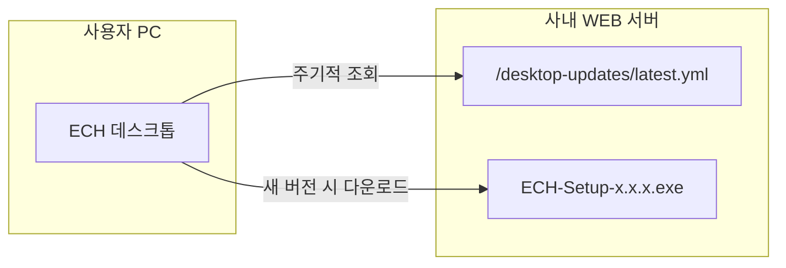

# ECH Windows Server 배포 가이드

## 서버 구성

| 역할 | IP | OS |
|---|---|---|
| WEB 서버 (백엔드 + 리얼타임) | 192.168.11.168 | Windows Server |
| DB 서버 (PostgreSQL) | 192.168.11.179 | Windows Server |

클라이언트 접속: `http://ech.co.kr:8080` (hosts 파일로 `ech.co.kr → 192.168.11.168` 지정)

---

## 사전 준비 — 개발 PC에서 빌드

WEB 서버로 복사할 파일을 먼저 빌드합니다.

```powershell
# 저장소 루트에서
cd backend
./gradlew.bat bootJar
# 결과물: backend/build/libs/ech-backend-{버전}.jar (버전은 backend/build.gradle 의 version)
```

---

## 1단계 — DB 서버 (192.168.11.179) 설정

### 1-1. PostgreSQL 설치
1. https://www.postgresql.org/download/windows/ 에서 PostgreSQL 15 이상 다운로드 후 설치
2. 설치 시 `postgres` 슈퍼유저 비밀번호 설정

### 1-2. DB 및 사용자 생성
pgAdmin 또는 psql 에서 실행:

```sql
CREATE USER ech_user WITH PASSWORD 'CHANGE_ME_STRONG_PASSWORD';
CREATE DATABASE ech OWNER ech_user ENCODING 'UTF8';
GRANT ALL PRIVILEGES ON DATABASE ech TO ech_user;
```

### 1-3. 원격 접속 허용 (WEB 서버 IP)
PostgreSQL 설치 경로 → `data/pg_hba.conf` 파일에 추가:

```
# WEB 서버에서 DB 접속 허용
host    ech    ech_user    192.168.11.168/32    scram-sha-256
```

`postgresql.conf` 에서 listen 주소 확인:
```
listen_addresses = '*'    # 또는 '192.168.11.179'
```

PostgreSQL 서비스 재시작 후 Windows 방화벽에서 **포트 5432** 를 WEB 서버 IP에서만 허용:

```powershell
# DB 서버 방화벽 (PowerShell, 관리자)
New-NetFirewallRule -DisplayName "PostgreSQL from WEB" -Direction Inbound `
  -Protocol TCP -LocalPort 5432 -RemoteAddress 192.168.11.168 -Action Allow
```

---

## 2단계 — WEB 서버 (192.168.11.168) 기본 설치

### 2-1. Java 17 설치
https://adoptium.net/ 에서 **Temurin JDK 17** Windows x64 설치
설치 후 확인:
```powershell
java -version   # "17.x.x" 출력 확인
```

### 2-2. Node.js 설치
https://nodejs.org 에서 **LTS 버전** (20.x 이상) Windows x64 설치
설치 후 확인:
```powershell
node -v    # "v20.x.x" 출력 확인
npm -v
```

### 2-3. PM2 전역 설치 (리얼타임 서비스 관리)
```powershell
npm install -g pm2
npm install -g pm2-windows-service
```

---

## 3단계 — WEB 서버 파일 배포

### 3-1. 배포 폴더 생성
```powershell
New-Item -ItemType Directory -Force C:\ECH\backend
New-Item -ItemType Directory -Force C:\ECH\realtime
New-Item -ItemType Directory -Force C:\ECH\logs
New-Item -ItemType Directory -Force C:\ECH\storage
New-Item -ItemType Directory -Force C:\ECH\releases
New-Item -ItemType Directory -Force C:\ECH\releases\desktop
```

### ECH 데스크톱 설치 경로(Windows)

- NSIS **`perMachine: true`** 로 **전역(All Users) 설치**이며, 기본 위치는 **`%PROGRAMFILES%\ECH\`** (예: `C:\Program Files\ECH\ECH.exe`) 입니다. 설치 시 **관리자(UAC) 승인**이 필요합니다.
- **`ech-server.json`**(선택, `serverUrl` / `updateBaseUrl`)은 앱이 아래 **먼저 존재하는 경로**를 읽습니다.
  1. `ECH.exe`와 같은 폴더 — 예: `C:\Program Files\ECH\ech-server.json` (일반 사용자는 수정이 어려울 수 있음)
  2. **`%ProgramData%\ECH\ech-server.json`** — 예: `C:\ProgramData\ECH\ech-server.json` (배포·그룹 정책으로 넣기에 적합)

### 데스크톱 앱 자동 업데이트(내부망)

#### 동작 개념 (동료·운영자에게 설명할 때)

- **한 줄 요약**: 설치된 ECH 데스크톱 앱이 **주기적으로(또는 실행 시)** 사내 백엔드에 올려둔 **「최신 버전 안내」(`latest.yml`)** 과 **설치 파일(NSIS `.exe`)** 을 받아, 새 버전이 있으면 사용자에게 알리고 설치할 수 있게 하는 방식입니다. 인터넷의 GitHub Releases 대신 **회사망 안의 웹 서버(백엔드와 동일 호스트)** 가 그 역할을 합니다.
- **비유**: 스마트폰 앱이 앱스토어에서 업데이트를 확인하는 것과 같고, **앱스토어 자리에 사내 서버**가 있다고 보면 됩니다. PC가 **외부 인터넷 없이** 내부망만 써도, **업데이트 URL만 사내 주소**로 잡혀 있으면 동일하게 동작합니다.
- **GitHub Releases를 쓸 때**: 릴리즈 페이지에 **Source code (zip/tar.gz)** 가 **GitHub가 태그 기준으로 자동 생성**해 붙는 항목입니다. `tools/publish-electron-github-release.ps1`가 추가로 올리는 **설치 exe·`latest.yml`·blockmap**과는 별개이며, **공개 저장소**에서는 누구나 소스 아카이브를 받을 수 있습니다. **소스 비공개가 정책이면** Private 저장소 또는 **내부망 `/desktop-updates/`만** 사용하는 배포를 권장합니다.
- **흐름**:
  1. 사용자 PC의 **ECH.exe**가 `ech-server.json`의 **`serverUrl`**(또는 `updateBaseUrl`)을 읽습니다.
  2. **`electron-updater`** 가 `{serverUrl}/desktop-updates/latest.yml` 을 요청해 **현재 배포된 버전·파일명**을 확인합니다.
  3. 로컬 설치 버전보다 새 버전이면, 같은 경로 베이스에서 **설치 파일**을 내려받고, 다운로드 완료 후 앱에서 안내(모달) → 사용자가 확인하면 설치·재시작합니다.



| 구성 요소 | 역할 |
|---|---|
| **ECH 데스크톱 (클라이언트)** | `electron-updater`로 메타·설치 파일 수신, 설치 안내 UI |
| **`ech-server.json`** | `serverUrl` 등으로 **업데이트를 어디서 받을지** 지정 (없으면 기본은 GitHub — 내부망에서는 실패 가능) |
| **`latest.yml`** | 버전·파일명·해시 등 메타데이터 (이 파일이 없으면 새 버전을 찾지 못함) |
| **설치 파일** (`ECH-Setup-*.exe`) | `latest.yml`의 `path`/`url`과 **실제 파일명이 일치**해야 함 |
| **백엔드 정적 경로** | `GET /desktop-updates/**` → 디스크의 `{APP_RELEASES_DIR}/desktop` 등 (`DesktopUpdateResourceConfig`) |

#### 운영 절차 (배포 담당자)

클라이언트 PC가 **GitHub에 나갈 수 없으면** `electron-updater`가 공개 릴리즈를 받지 못합니다. 이 경우 **백엔드가 같은 호스트에서** 업데이트 파일을 제공합니다.

1. **백엔드**가 `GET http://{백엔드}:8080/desktop-updates/latest.yml` 및 동일 베이스 URL의 설치 파일(`ECH-Setup-x.x.x.exe`)을 제공합니다. 파일 실제 위치는 기본값 `{APP_RELEASES_DIR}/desktop`(예: `C:\ECH\releases\desktop`). 다른 경로를 쓰려면 환경변수 `DESKTOP_UPDATE_DIR`을 설정합니다.
2. 새 버전 배포 시 `desktop/dist/`에서 **`latest.yml`**, **`ECH-Setup-{version}.exe`**, (있으면) **`.blockmap`** 을 위 `desktop` 폴더에 복사합니다. `latest.yml` 안의 `url`/`path`와 디스크의 파일명이 일치해야 합니다.
3. 사용자 PC에 **`ech-server.json`** 으로 `serverUrl`(예: `http://ech.co.kr:8080`)을 알려주면, 앱은 자동으로 `{serverUrl}/desktop-updates/` 를 업데이트 소스로 사용합니다. 파일 위치는 위 **「ECH 데스크톱 설치 경로」** 절을 따릅니다. 업데이트 URL만 따로 쓰려면 `updateBaseUrl`을 지정합니다.
4. `ech-server.json`이 없고 GitHub도 막혀 있으면 자동 업데이트는 계속 실패합니다 — 내부망에서는 반드시 `ech-server.json` + 위 파일 배포를 권장합니다.

### 3-2. 파일 복사
저장소에서 WEB 서버로 아래 파일/폴더를 복사:

| 복사 원본 (개발 PC) | 복사 대상 (WEB 서버) |
|---|---|
| `backend/build/libs/ech-backend-*.jar` | `C:\ECH\backend\ech-backend.jar` |
| `realtime/` 폴더 전체 | `C:\ECH\realtime\` |
| `deploy/pm2.ecosystem.config.cjs` | `C:\ECH\realtime\pm2.ecosystem.config.cjs` |

### 3-3. 리얼타임 의존성 설치
```powershell
cd C:\ECH\realtime
npm install --omit=dev
```

---

## 4단계 — 환경변수 설정

`deploy/env.prod` 파일을 참고해 **WEB 서버 시스템 환경변수** 로 등록합니다.

```powershell
# PowerShell (관리자) — 시스템 환경변수 일괄 등록
$vars = @{
    "DB_HOST"                   = "192.168.11.179"
    "DB_PORT"                   = "5432"
    "DB_NAME"                   = "ech"
    "DB_USER"                   = "ech_user"
    "DB_PASSWORD"               = "CHANGE_ME_STRONG_PASSWORD"
    "SPRING_PORT"               = "8080"
    "EXPOSE_ERROR_DETAIL"       = "false"
    "JWT_SECRET"                = "CHANGE_ME_32_OR_MORE_RANDOM_CHARS_HERE"
    "JWT_EXPIRATION_MS"         = "28800000"
    "REALTIME_INTERNAL_TOKEN"   = "CHANGE_ME_INTERNAL_SECRET"
    "REALTIME_INTERNAL_BASE_URL"= "http://localhost:3001"
    "FILE_STORAGE_DIR"          = "C:/ECH/storage"
    "APP_RELEASES_DIR"          = "C:/ECH/releases"
    "MAX_UPLOAD_SIZE"           = "500MB"
    "MAX_REQUEST_SIZE"          = "500MB"
}
foreach ($k in $vars.Keys) {
    [System.Environment]::SetEnvironmentVariable($k, $vars[$k], "Machine")
    Write-Host "SET $k"
}
Write-Host "완료. 새 터미널/서비스 재시작 후 적용됩니다."
```

> **보안 주의**: `JWT_SECRET`, `DB_PASSWORD`, `REALTIME_INTERNAL_TOKEN` 은 반드시 추측 불가한 값으로 교체하세요.
> - JWT_SECRET 생성: `[Convert]::ToBase64String((1..32|%{[byte](Get-Random -Max 256)}))`

> **첨부파일 경로(중요)**: 실제 저장 위치는 **DB `app_settings` 의 `file.storage.base-dir` 값이 `FILE_STORAGE_DIR` 환경변수보다 우선**합니다. 서버를 **처음** 띄울 때 환경변수가 비어 있거나 개발 기본값(`D:/testStorage`)으로 시드되면, 나중에 `FILE_STORAGE_DIR` 만 `C:/ECH/storage` 로 바꿔도 **DB 예전 값 때문에 업로드가 계속 실패**할 수 있습니다. 조치: 관리자 **설정** 화면에서 `file.storage.base-dir` 을 운영 경로로 수정하거나, 아래 SQL로 갱신 후 백엔드 재시작을 권장합니다. 기동 로그에 `[ECH] file storage ready:` 또는 `NOT writable` 이 출력됩니다.

---

## 5단계 — 백엔드 Windows 서비스 등록 (NSSM)

NSSM(Non-Sucking Service Manager) 다운로드: https://nssm.cc/download

```powershell
# NSSM 을 C:\tools\nssm.exe 에 저장 후
C:\tools\nssm.exe install ECH-Backend "java" `
  "-Xms256m -Xmx1g -jar C:\ECH\backend\ech-backend.jar"

# 서비스 시작 디렉터리 설정
C:\tools\nssm.exe set ECH-Backend AppDirectory "C:\ECH\backend"

# 로그 설정
C:\tools\nssm.exe set ECH-Backend AppStdout "C:\ECH\logs\backend-out.log"
C:\tools\nssm.exe set ECH-Backend AppStderr "C:\ECH\logs\backend-error.log"
C:\tools\nssm.exe set ECH-Backend AppRotateFiles 1
C:\tools\nssm.exe set ECH-Backend AppRotateBytes 10485760

# 서비스 시작
Start-Service ECH-Backend
```

서비스 상태 확인:
```powershell
Get-Service ECH-Backend
# Status: Running 확인
curl http://localhost:8080/api/health
```

---

## 6단계 — 리얼타임 서버 PM2 서비스 등록

### 6-1. pm2.ecosystem.config.cjs 수정
`C:\ECH\realtime\pm2.ecosystem.config.cjs` 를 열어 `DB_PASSWORD`, `REALTIME_INTERNAL_TOKEN` 등을 실제 값으로 수정합니다.

### 6-2. PM2 시작 및 Windows 서비스 등록
```powershell
cd C:\ECH\realtime
pm2 start pm2.ecosystem.config.cjs
pm2 save

# Windows 서비스로 등록 (서버 재부팅 시 자동 시작)
pm2-service-install
# 설치 완료 후 서비스 이름: PM2
Start-Service PM2
```

상태 확인:
```powershell
pm2 list
# ech-realtime  online 확인
curl http://localhost:3001/health
```

---

## 7단계 — Windows 방화벽 포트 개방

WEB 서버에서 클라이언트가 접근할 포트를 개방합니다:

```powershell
# PowerShell (관리자)

# Spring Boot (백엔드 + 프론트엔드)
New-NetFirewallRule -DisplayName "ECH Backend 8080" -Direction Inbound `
  -Protocol TCP -LocalPort 8080 -Action Allow

# Realtime Socket.IO
New-NetFirewallRule -DisplayName "ECH Realtime 3001" -Direction Inbound `
  -Protocol TCP -LocalPort 3001 -Action Allow
```

---

## 8단계 — 클라이언트 PC hosts 파일 설정

각 사용자 PC의 `C:\Windows\System32\drivers\etc\hosts` 파일에 추가 (관리자 권한 필요):

```
192.168.11.168    ech.co.kr
```

PowerShell (관리자)로 일괄 추가:
```powershell
Add-Content -Path "C:\Windows\System32\drivers\etc\hosts" -Value "`n192.168.11.168    ech.co.kr"
```

> GPO(그룹 정책)를 사용하는 경우 WSUS 또는 로그온 스크립트로 자동 배포 가능합니다.

---

## 9단계 — 접속 확인

```powershell
# WEB 서버 내부에서
curl http://localhost:8080/api/health      # {"status":"UP"} 확인
curl http://localhost:3001/health          # {"status":"ok"} 확인

# 클라이언트 PC에서 (hosts 설정 후)
# 브라우저 주소창: http://ech.co.kr:8080
```

---

## 업데이트 절차 (이후 배포)

운영 백엔드는 **JAR 안의 클래스**와 별도로, **`{설치경로}\frontend\`** 의 `index.html` / `styles.css` / `app.js` 를 읽습니다(`FrontendResourceConfig`). **JAR만 갈아끼우면 API·`/desktop-updates` 등은 새 버전이 되지만, 웹 화면은 예전 파일 그대로**일 수 있으므로 아래를 함께 반영하세요.

### 방법 A — ZIP으로 통째로 갱신 (권장, 변경 범위 클 때)

개발 PC(인터넷 가능)에서:

```powershell
cd "저장소 루트"
.\deploy\build-package.ps1
```

생성된 `deploy\ECH-deploy.zip` 을 WEB 서버로 옮긴 뒤, **기존 `C:\ECH-deploy` 를 백업**하고 압축 해제한 다음 관리자 PowerShell에서 `.\setup-web-server.ps1` 을 다시 실행해도 되고, 이미 서비스가 있으면 **수동으로 파일만 덮어쓴 뒤 서비스만 재시작**해도 됩니다(아래 방법 B와 동일 파일 세트).

### 방법 B — 최소 패치 (이미 `C:\ECH` 구조가 잡혀 있을 때)

개발 PC에서 빌드 후, 아래를 WEB 서버(`192.168.11.168` 등)로 복사합니다. 경로는 설치 시 쓴 `INSTALL_DIR` 기준(문서 예시는 `C:\ECH`).

```powershell
# 0. 변수 (개발 PC — 저장소 루트에서 실행)
$WEB = "\\192.168.11.168\c$\ECH"   # 실제 서버 주소/공유로 변경

# 1. Spring Boot JAR (plain 제외한 fat JAR 하나를 ech-backend.jar 로 덮어쓰기)
cd backend
.\gradlew.bat bootJar
cd ..
$jar = Get-ChildItem "backend\build\libs\*.jar" | Where-Object { $_.Name -notmatch "plain" } |
       Sort-Object LastWriteTime -Descending | Select-Object -First 1
Copy-Item $jar.FullName "$WEB\backend\ech-backend.jar" -Force

# 2. 프론트엔드 (필수 — 웹 UI 갱신)
Copy-Item "frontend\index.html" "$WEB\frontend\" -Force
Copy-Item "frontend\styles.css" "$WEB\frontend\" -Force
Copy-Item "frontend\app.js"     "$WEB\frontend\" -Force

# 3. 리얼타임 코드가 이번 릴리즈에 포함되었으면 realtime 폴더 통째로 덮어쓰기 후
#    WEB 서버에서: cd C:\ECH\realtime && npm install --omit=dev && pm2 restart ech-realtime
```

WEB 서버에서:

```powershell
Restart-Service ECH-Backend
# 리얼타임을 갱신했을 때만
# cd C:\ECH\realtime; pm2 restart ech-realtime
```

### 데스크톱 자동 업데이트 파일(내부망)

Electron 설치형을 배포하는 경우, 새 버전마다 `desktop` 빌드 산출물을 서버의 **`C:\ECH\releases\desktop`**(또는 `DESKTOP_UPDATE_DIR`)에 넣습니다.

```powershell
# 개발 PC (예: desktop\dist 에 빌드된 뒤)
$rel = "\\192.168.11.168\c$\ECH\releases\desktop"
Copy-Item "desktop\dist\latest.yml"           $rel -Force
Copy-Item "desktop\dist\ECH-Setup-*.exe"      $rel -Force
# 있으면 blockmap도 함께
```

동작 확인(브라우저 또는 WEB 서버에서):

- `http://ech.co.kr:8080/api/health`
- `http://ech.co.kr:8080/desktop-updates/latest.yml` (파일이 있으면 200·본문에 버전 정보)

환경변수 `APP_RELEASES_DIR` / `DESKTOP_UPDATE_DIR` 를 바꾼 적이 없다면 **추가 패치는 필요 없습니다**. 새 코드만 위 파일들로 반영하면 됩니다.

---

## 선택: Nginx 리버스 프록시 (포트 없이 http://ech.co.kr 접속)

포트 번호 없이 `http://ech.co.kr` 로만 접속하려면 Nginx를 추가합니다.

### Nginx 설치 및 설정

1. https://nginx.org/en/download.html 에서 Windows용 Nginx 다운로드
2. `C:\nginx\` 에 압축 해제
3. `deploy/nginx.conf` 파일을 `C:\nginx\conf\nginx.conf` 로 덮어쓰기
4. Nginx 실행:
   ```powershell
   cd C:\nginx
   Start-Process nginx.exe
   ```
5. Windows 방화벽에서 포트 **80** 추가 개방:
   ```powershell
   New-NetFirewallRule -DisplayName "ECH Nginx 80" -Direction Inbound `
     -Protocol TCP -LocalPort 80 -Action Allow
   ```

Nginx 사용 시 클라이언트는 `http://ech.co.kr` (포트 없음) 로 접속합니다.
Socket.IO 도 Nginx가 `/socket.io/` 경로로 프록시하므로 별도 포트 불필요.

> Nginx를 사용하면 `deploy/nginx.conf` 의 `nginx.conf` 를 NSSM 으로 서비스 등록하는 것도 권장합니다.
> ```powershell
> C:\tools\nssm.exe install ECH-Nginx "C:\nginx\nginx.exe"
> C:\tools\nssm.exe set ECH-Nginx AppDirectory "C:\nginx"
> Start-Service ECH-Nginx
> ```

---

## 트러블슈팅

| 증상 | 원인 | 조치 |
|---|---|---|
| 백엔드 기동 안 됨 | 환경변수 미적용 | 서비스 재시작 또는 `Get-ChildItem Env:` 로 확인 |
| DB 연결 실패 | 5432 방화벽 또는 pg_hba.conf | DB 서버 방화벽·`pg_hba.conf` 확인 |
| Socket.IO 연결 안 됨 | 3001 방화벽 또는 리얼타임 미기동 | `pm2 list`, 방화벽 규칙 확인 |
| 파일 업로드 실패 | DB `file.storage.base-dir` 가 존재하지 않는 드라이브·경로(예: `D:/testStorage`) | `app_settings` 또는 관리자 설정에서 `C:/ECH/storage` 등 실제 경로로 수정 |
| 파일 업로드 실패 | `C:\ECH\storage` 미생성 또는 NSSM **Local System** 에 쓰기 거부 | 폴더 생성 후 해당 폴더에 **Users** 또는 서비스 계정 **수정** 권한 부여 |
| 파일 업로드 실패(413) | Nginx `client_max_body_size` 또는 Spring `MAX_UPLOAD_SIZE` | `deploy/nginx.conf` 의 `client_max_body_size` 와 `MAX_UPLOAD_SIZE`/`MAX_REQUEST_SIZE` 정합 |
| 파일 업로드 실패 | UNC(네트워크 공유) 저장 + 서비스 계정이 공유에 접근 불가 | `setup-web-server.ps1` 안내처럼 동일 로컬 서비스 계정·공유 권한 구성 |
| 로그인 후 토큰 오류 | `JWT_SECRET` 미설정 | 환경변수 `JWT_SECRET` 확인 및 서비스 재시작 |

### 첨부 경로 긴급 수정 (SQL 예시)

pgAdmin/psql 에서 (`C:/ECH/storage` 는 환경에 맞게 변경):

```sql
UPDATE app_settings
SET setting_value = 'C:/ECH/storage', updated_at = NOW()
WHERE setting_key = 'file.storage.base-dir';
```

이후 `Restart-Service ECH-Backend` — 기동 로그에 `[ECH] file storage ready: C:\ECH\storage` 가 보이면 정상입니다.

### UNC 공유(`\\192.168.11.179\ECHStorage` 등) 접근 확인

**RDP로 웹 서버에 로그온한 관리자**가 PowerShell에서 아래가 성공해도, **NSSM 백엔드 서비스 계정**(기본 **Local System**)은 UNC에 접근하지 못하는 경우가 많습니다. 반드시 **백엔드와 동일 프로세스 권한**으로 검사하세요.

1. **권장 — API 진단 (ADMIN JWT)**  
   관리자로 웹에 로그인한 뒤 브라우저 개발자 도구 또는 `curl`로 호출:
   ```http
   GET /api/admin/storage/probe
   Authorization: Bearer <관리자_액세스_토큰>
   ```
   응답 JSON의 `data.writable` 이 `true` 이고 `detail` 이 `"ok"` 이면, 실제 업로드와 동일하게 저장 루트에 임시 파일 쓰기·삭제까지 성공한 것입니다. `uncPath: true` 인데 `writable: false` 이면 공유 권한 또는 **서비스 실행 계정**을 `setup-web-server.ps1` 의 UNC 안내(동일 로컬 계정 `echsvc` 등)대로 맞춥니다.

2. **참고 — 대화형 PowerShell만으로는 불충분**  
   ```powershell
   Test-Path \\192.168.11.179\ECHStorage
   "probe" | Out-File \\192.168.11.179\ECHStorage\_ech_manual_probe.txt -Encoding utf8
   Remove-Item \\192.168.11.179\ECHStorage\_ech_manual_probe.txt
   ```
   위는 **현재 로그온 사용자** 권한만 검증합니다. 백엔드 서비스 계정과 다를 수 있습니다.
